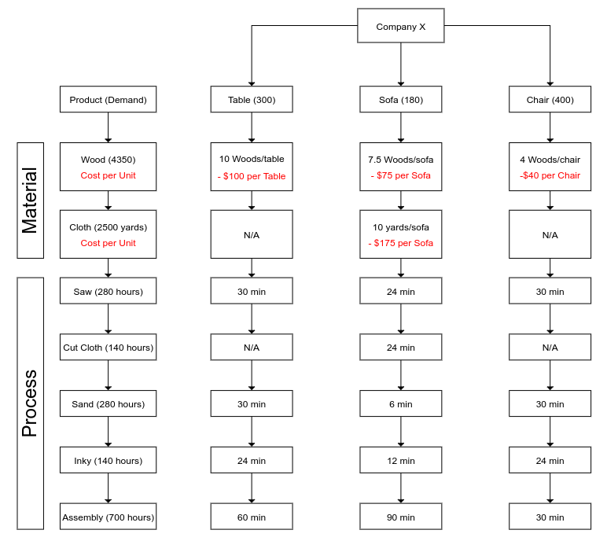

# Linear-Programming-With-Python

Solving Linear Programming problems using Simplex Method with `linprog` from `scipy.optimize` and `numpy` libraries on Python.

## Linear Programming

Linear programming is used to solve optimization problems. In a LP problem must be defined an **Objective Function** and **Constraints**, and they must be **Strictly Linears**. Constraints may be equalities or inequalities.

### Example:

Variables:

   

Objective Function:

   

Constraints:

   

## Requirement

We are going to use, Scipy and Numpy libraries to solve LP problems.

Install via pip: 

    pip3 install scipy numpy

Install via conda: 

    conda install scipy numpy

## Examples

* [Solving LP Problem](https://github.com/Gabeqb/Linear-Programming-With-Python/blob/master/notebooks/LP-Problem01.ipynb "Problem01")

* [Solving Integer LP Problem](https://github.com/Gabeqb/Linear-Programming-With-Python/blob/master/notebooks/LP-Problem02.ipynb "Problem02")

## Company X Problem

[Solving Company X Problem](https://github.com/Gabeqb/Linear-Programming-With-Python/blob/master/notebooks/CompanyX-Problem.ipynb)
